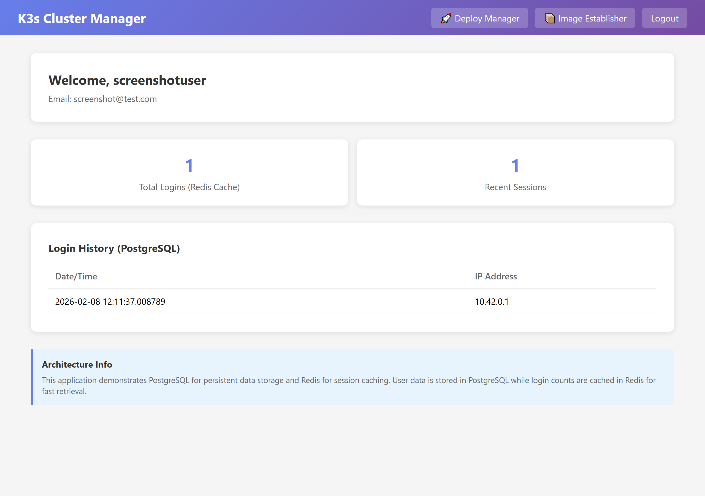
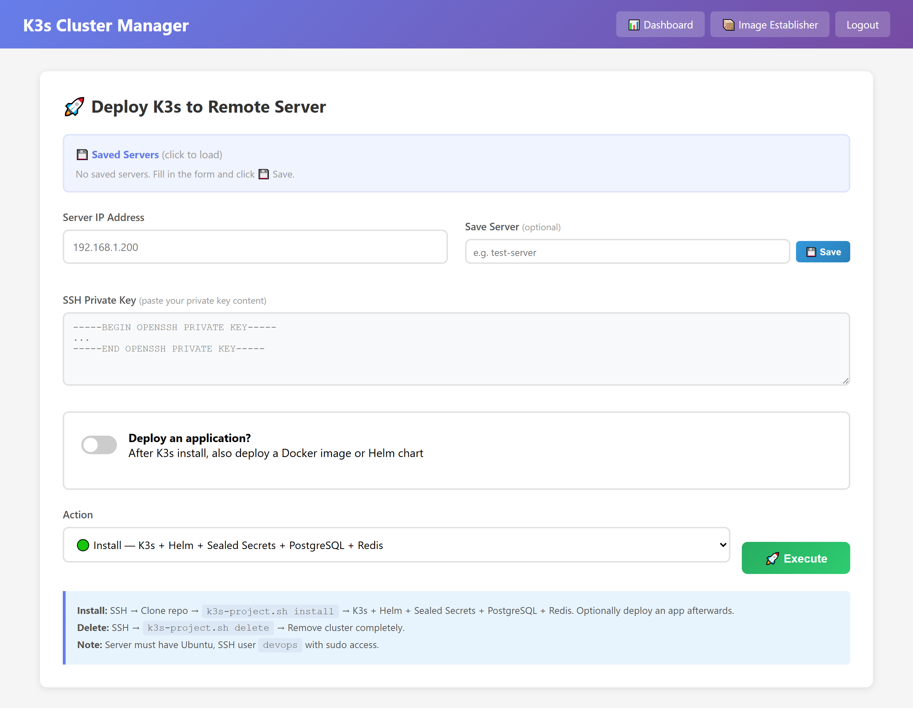

# K3s Local Kubernetes Cluster

Automated K3s cluster deployment with Sealed Secrets, PostgreSQL, Redis, and a Flask-based management application. All sensitive data is encrypted at rest using Bitnami Sealed Secrets -- no plain text passwords exist in this repository.

---

## Table of Contents

1. [Prerequisites](#prerequisites)
2. [Quick Start](#quick-start)
3. [What Gets Installed](#what-gets-installed)
4. [How Sealed Secrets Work](#how-sealed-secrets-work)
5. [Installation Guide](#installation-guide)
6. [Manual Sealed Secret Management](#manual-sealed-secret-management)
7. [Application Features](#application-features)
8. [Project Structure](#project-structure)
9. [Useful Commands](#useful-commands)
10. [Uninstall](#uninstall)
11. [Architecture](#architecture)

---

## Prerequisites

| Requirement | Specification |
|-------------|---------------|
| OS | Ubuntu 24.04 LTS |
| RAM | Minimum 4 GB |
| CPU | Minimum 2 cores |
| Disk | 40 GB available |
| Access | Root or sudo privileges |
| Network | Internet access (for downloading packages) |

---

## Quick Start

```bash
# Clone the repository
git clone https://github.com/smtdmrll/k3s-local-cluster.git
cd k3s-local-cluster

# Make the script executable
chmod +x scripts/k3s-project.sh

# Option A: Infrastructure only (no web app)
sudo ./scripts/k3s-project.sh install

# Option B: Full stack with web application
sudo ./scripts/k3s-project.sh install-withapp
```

After installation completes, the script prints all access URLs and credential locations.

---

## What Gets Installed

### Option 1: `install` (Infrastructure Only)

| Component | Namespace | Port | Description |
|-----------|-----------|------|-------------|
| K3s | -- | 6443 | Lightweight Kubernetes distribution |
| Helm | -- | -- | Kubernetes package manager |
| Sealed Secrets Controller | kube-system | -- | Decrypts SealedSecret resources into Secrets |
| kubeseal CLI | -- | -- | Encrypts plain secrets into SealedSecrets |
| PostgreSQL 17 | postgres | 30432 | Relational database (Bitnami Helm chart) |
| Redis 7 | redis | 30379 | In-memory cache (Bitnami Helm chart) |
| Backup CronJob | backup | -- | Daily PostgreSQL backup at 02:00 UTC |

### Option 2: `install-withapp` (Full Stack)

Everything from Option 1, plus:

| Component | Namespace | Port | Description |
|-----------|-----------|------|-------------|
| Login App | login-app | 30080 | Flask web application with Deploy Manager |
| SealedSecret | login-app | -- | Encrypted secret for app credentials |

The web application is accessible at `http://<SERVER-IP>:30080`.

---

## How Sealed Secrets Work

### The Problem

Kubernetes Secrets are base64-encoded, not encrypted. Anyone with access to the repository or cluster can decode them:

```bash
# base64 is NOT encryption
echo "cGFzc3dvcmQxMjM=" | base64 -d
# Output: password123
```

Storing Secret manifests in Git means passwords are visible in the commit history.

### The Solution: Sealed Secrets

Sealed Secrets uses asymmetric encryption (public/private key pair). The flow works as follows:

```
                  Developer Workstation                         Kubernetes Cluster
                  ----------------------                         ------------------

  1. Create plain Secret (dry-run)        
     kubectl create secret generic        
       --dry-run=client -o yaml           
              |                           
              v                           
  2. Encrypt with kubeseal                
     kubeseal --cert pub-cert.pem         
              |                           
              v                           
  3. SealedSecret YAML (safe for Git)     ------>  4. Applied to cluster
     - Contains encrypted data                          |
     - Can be committed to Git                          v
     - Cannot be decrypted without                 5. Sealed Secrets Controller
       the private key                                  reads SealedSecret
                                                        |
                                                        v
                                                   6. Decrypts using private key
                                                      (stored only in cluster)
                                                        |
                                                        v
                                                   7. Creates regular Secret
                                                      (accessible by pods)
```

Key points:
- The **private key** exists only inside the cluster (in the controller pod)
- The **public certificate** is used to encrypt -- it is safe to distribute
- Each SealedSecret is **bound to a specific namespace and name**
- Even if someone obtains the SealedSecret YAML, they cannot decrypt it without cluster access

### What the Install Script Does

When you run `install-withapp`, the script performs these steps for secrets:

```bash
# 1. Generates random passwords
POSTGRES_PASSWORD=$(openssl rand -base64 16 | tr -dc 'a-zA-Z0-9' | head -c 16)

# 2. Fetches the controller's public certificate
kubeseal --fetch-cert \
  --controller-name=sealed-secrets \
  --controller-namespace=kube-system \
  > sealed-secrets/pub-cert.pem

# 3. Creates a plain Secret (only in memory, never written to disk)
kubectl create secret generic login-app-secret \
  --namespace=login-app \
  --from-literal=POSTGRES_PASSWORD="$POSTGRES_PASSWORD" \
  --from-literal=REDIS_PASSWORD="$REDIS_PASSWORD" \
  --from-literal=SECRET_KEY="$APP_SECRET_KEY" \
  --dry-run=client -o yaml | \

# 4. Pipes it through kubeseal to encrypt
kubeseal --cert sealed-secrets/pub-cert.pem --format yaml | \

# 5. Applies the encrypted SealedSecret to the cluster
kubectl apply -f -

# 6. The controller automatically decrypts it into a regular Secret
# 7. Helm chart references this Secret by name (login-app-secret)
```

The plain text passwords are saved locally in `.postgres-password` and `.redis-password` (both in `.gitignore`). They never enter the Git repository.

---

## Installation Guide

### Step 1: Prepare the Server

```bash
# SSH into your Ubuntu server
ssh user@<SERVER-IP>

# Clone the repository
git clone https://github.com/smtdmrll/k3s-local-cluster.git
cd k3s-local-cluster
chmod +x scripts/k3s-project.sh
```

### Step 2: Run the Installer

For infrastructure only:

```bash
sudo ./scripts/k3s-project.sh install
```

For the full stack with the web application:

```bash
sudo ./scripts/k3s-project.sh install-withapp
```

The script runs the following sequence:

```
check_root / check_ubuntu
        |
install_dependencies  (curl, jq, postgresql-client, redis-tools)
        |
install_k3s           (curl -sfL https://get.k3s.io | sh)
        |
install_helm          (official Helm installer script)
        |
install_sealed_secrets_controller  (Helm chart: sealed-secrets/sealed-secrets)
        |
install_kubeseal_cli  (v0.27.3 binary from GitHub releases)
        |
fetch_sealed_secrets_cert  (saves pub-cert.pem for encrypting secrets)
        |
create_namespaces     (postgres, redis, login-app, backup)
        |
deploy_postgresql     (Bitnami chart, NodePort 30432, random password)
        |
deploy_postgresql_backup  (CronJob, daily at 02:00, 7-day retention)
        |
deploy_redis          (Bitnami chart, NodePort 30379, random password)
        |
[install-withapp only]
        |
deploy_login_app      (creates SealedSecret -> deploys Helm chart)
```

### Step 3: Verify

```bash
# Check all pods are running
sudo kubectl get pods -A

# Check sealed secrets
sudo kubectl get sealedsecret -A

# Check the decrypted secret exists
sudo kubectl get secret login-app-secret -n login-app

# Test the application
curl http://localhost:30080/ready
# Expected: {"status":"ready","database":"connected","cache":"connected"}
```

### Step 4: Access the Application

Open `http://<SERVER-IP>:30080` in your browser. Register a new account to get started.

---

## Manual Sealed Secret Management

If you need to create or update secrets manually (outside the install script):

### Create a New Sealed Secret

```bash
# Fetch the public certificate (if you do not have it)
sudo kubeseal --fetch-cert \
  --controller-name=sealed-secrets \
  --controller-namespace=kube-system \
  > pub-cert.pem

# Create and encrypt in one pipeline
kubectl create secret generic my-secret \
  --namespace=my-namespace \
  --from-literal=DB_PASSWORD='newpassword123' \
  --from-literal=API_KEY='my-api-key' \
  --dry-run=client -o yaml | \
kubeseal --cert pub-cert.pem --format yaml > my-sealedsecret.yaml

# Apply
kubectl apply -f my-sealedsecret.yaml

# Verify the controller created the regular Secret
kubectl get secret my-secret -n my-namespace
```

### Update an Existing Secret

Sealed Secrets are immutable. To update, delete and recreate:

```bash
# Delete the old SealedSecret
kubectl delete sealedsecret my-secret -n my-namespace

# Create a new one with updated values (same pipeline as above)
kubectl create secret generic my-secret \
  --namespace=my-namespace \
  --from-literal=DB_PASSWORD='updatedPassword456' \
  --dry-run=client -o yaml | \
kubeseal --cert pub-cert.pem --format yaml | \
kubectl apply -f -
```

### Rotate Application Secrets

```bash
# Generate new passwords
NEW_PG_PASS=$(openssl rand -base64 16 | tr -dc 'a-zA-Z0-9' | head -c 16)
NEW_REDIS_PASS=$(openssl rand -base64 16 | tr -dc 'a-zA-Z0-9' | head -c 16)
NEW_SECRET_KEY=$(openssl rand -base64 16 | tr -dc 'a-zA-Z0-9' | head -c 16)

# Delete old sealed secret
kubectl delete sealedsecret login-app-secret -n login-app

# Create new sealed secret
kubectl create secret generic login-app-secret \
  --namespace=login-app \
  --from-literal=POSTGRES_PASSWORD="$NEW_PG_PASS" \
  --from-literal=REDIS_PASSWORD="$NEW_REDIS_PASS" \
  --from-literal=SECRET_KEY="$NEW_SECRET_KEY" \
  --dry-run=client -o yaml | \
kubeseal --cert sealed-secrets/pub-cert.pem --format yaml | \
kubectl apply -f -

# Restart the application to pick up new secrets
kubectl rollout restart deployment login-app -n login-app
```

Note: You must also update the PostgreSQL and Redis passwords in their respective deployments for the new credentials to work end-to-end.

---

## Application Features

The Login App provides a web-based interface for managing Kubernetes deployments.

### Dashboard

User management panel with session tracking.

<p align="center">
  
</p>

### Deploy Manager

Deploys K3s clusters on remote Ubuntu servers via SSH.

<p align="center">
  
</p>

Capabilities:
- One-click K3s installation on remote servers
- Optional Docker image or Helm chart deployment after K3s setup
- SSH key-based authentication
- Real-time deployment logs
- Persistent server configuration storage

### Image Establisher

Instant Docker image deployment to existing K3s clusters. Creates a Deployment, Service (NodePort), and returns the access URL.

### Saved Servers

Stores server credentials (IP + SSH key) per user. Enables quick server selection across Deploy Manager and Image Establisher.

---

## Project Structure

```
k3s-local-cluster/
|-- app/                          # Flask application
|   |-- app.py                    # Main backend (routes, SSH logic)
|   |-- Dockerfile                # Container build definition
|   |-- requirements.txt          # Python dependencies
|   +-- templates/                # HTML templates
|       |-- login.html
|       |-- register.html
|       |-- dashboard.html
|       |-- deploy.html
|       +-- establish.html
|-- helm/login-app/               # Helm chart for the application
|   |-- Chart.yaml                # Chart metadata
|   |-- values.yaml               # Default values (no secrets)
|   +-- templates/
|       |-- deployment.yaml       # Pod spec with secret references
|       |-- service.yaml          # NodePort service
|       |-- configmap.yaml        # Non-sensitive env variables
|       +-- _helpers.tpl          # Template helper functions
|-- scripts/
|   |-- k3s-project.sh           # Main installer script
|   |-- test-postgres.sh         # PostgreSQL connectivity test
|   +-- test-redis.sh            # Redis connectivity test
|-- docs/
|   |-- architecture.svg         # Architecture diagram
|   +-- screenshots/             # Application screenshots
|-- .github/workflows/ci.yaml    # CI/CD pipeline
|-- .gitignore                    # Excludes passwords and local files
+-- README.md
```

Files excluded from Git (via .gitignore):
- `.postgres-password` -- generated PostgreSQL password
- `.redis-password` -- generated Redis password
- `sealed-secrets/` -- public certificate (cluster-specific)

---

## Useful Commands

```bash
# Cluster status
sudo ./scripts/k3s-project.sh status

# View all pods
sudo kubectl get pods -A

# View all services
sudo kubectl get svc -A

# View Helm releases
sudo helm list -A

# View sealed secrets
sudo kubectl get sealedsecret -A

# View logs for the app
sudo kubectl logs -n login-app -l app.kubernetes.io/name=login-app

# Check if controller can decrypt
sudo kubectl get sealedsecret -n login-app -o yaml | grep -A1 status

# Read the stored PostgreSQL password
cat .postgres-password

# Read the stored Redis password
cat .redis-password

# Add a worker node to the cluster
# On the master:
cat /var/lib/rancher/k3s/server/node-token
# On the worker:
curl -sfL https://get.k3s.io | K3S_URL=https://<MASTER-IP>:6443 K3S_TOKEN=<TOKEN> sh -
```

---

## Uninstall

```bash
sudo ./scripts/k3s-project.sh delete
```

This removes: all Helm releases, all namespaces (login-app, postgres, redis, backup), Sealed Secrets controller, K3s itself, and local credential files.

---

## Architecture

<p align="center">
  
</p>

---

## License

MIT
