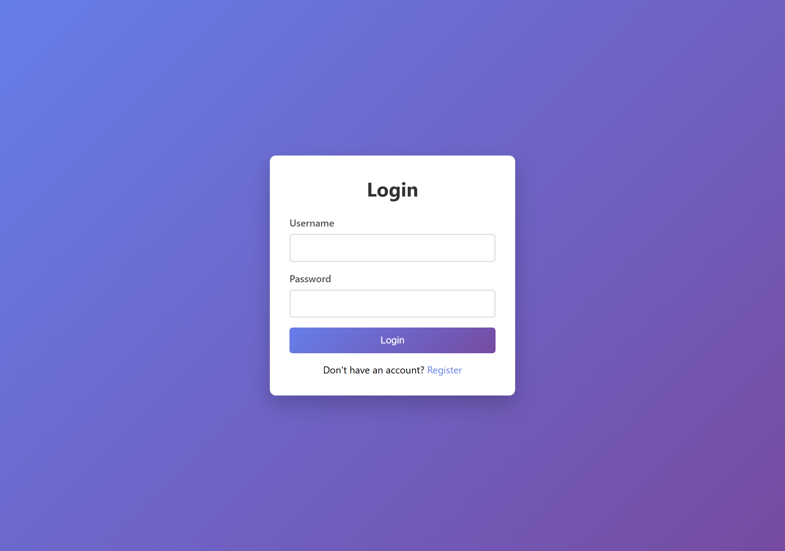
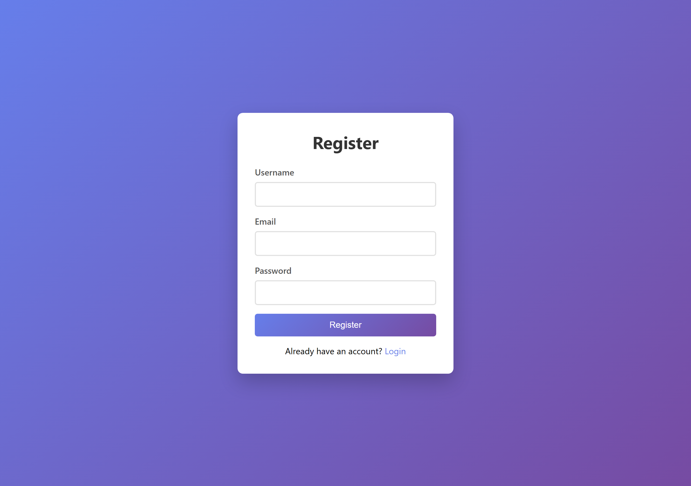
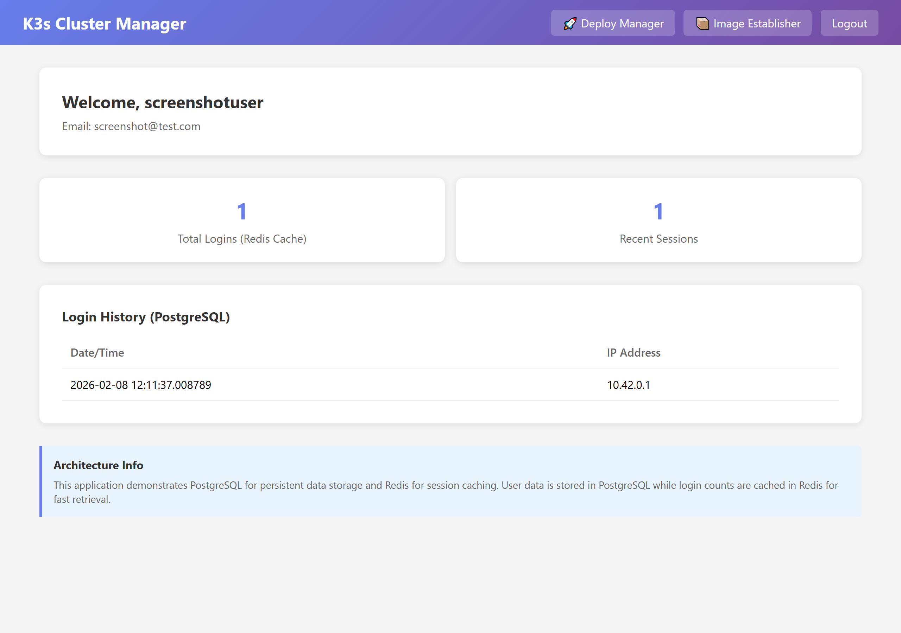
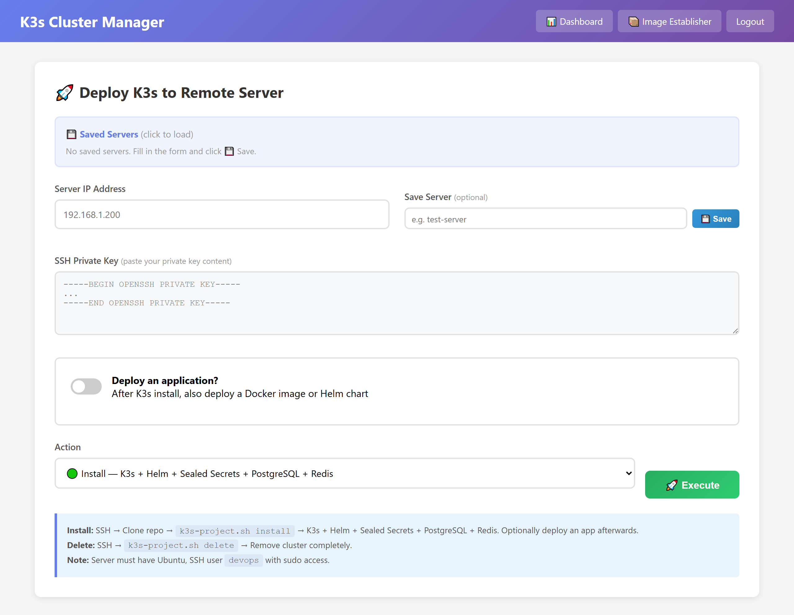

# K3s Local Kubernetes Cluster

A complete DevOps project that deploys a lightweight Kubernetes cluster (K3s) on Ubuntu with PostgreSQL, Redis, Sealed Secrets and a full-featured **Login Application** including **Deploy Manager** and **Image Establisher** tools.

---

## 📋 Table of Contents

- [Architecture](#-architecture)
- [Prerequisites](#-prerequisites)
- [Quick Start](#-quick-start)
  - [Option 1: Cluster Only (install)](#option-1-cluster-only-install)
  - [Option 2: Cluster + Application (install-withapp)](#option-2-cluster--application-install-withapp)
- [Application Features](#-application-features)
  - [Login & Register](#1-login--register)
  - [Dashboard](#2-dashboard)
  - [Deploy Manager](#3-deploy-manager)
  - [Image Establisher](#4-image-establisher)
  - [Saved Servers](#5-saved-servers)
- [Components](#-components)
- [Scripts](#-scripts)
- [Backup](#-backup)
- [Multi-Node Migration](#-multi-node-migration)
- [Tech Stack](#-tech-stack)
- [License](#-license)

---

## 🏗 Architecture

<p align="center">
  
</p>

---

## 📌 Prerequisites

| Requirement | Details |
|-------------|---------|
| **OS** | Ubuntu 24.04 LTS (fresh installation) |
| **Hardware** | Minimum 4 GB RAM, 2 CPU, 40 GB Disk |
| **Network** | Internet connection required |
| **Access** | Root or sudo access |

---

## 🚀 Quick Start

```bash
git clone https://github.com/smtdmrll/k3s-local-cluster.git
cd k3s-local-cluster
chmod +x scripts/k3s-project.sh
```

### Option 1: Cluster Only (`install`)

Sadece Kubernetes altyapısını kurar. Login App **kurulmaz**.

```bash
sudo ./scripts/k3s-project.sh install
```

Bu komut şunları kurar:
- ✅ K3s (Lightweight Kubernetes)
- ✅ Helm (Paket Yöneticisi)
- ✅ Sealed Secrets (Secret Şifreleme)
- ✅ PostgreSQL (Veritabanı — NodePort 30432)
- ✅ Redis (Cache — NodePort 30379)
- ✅ PostgreSQL Backup CronJob (Günlük yedekleme)

> **Ne zaman kullanılır?** Kendi uygulamanızı deploy etmek istiyorsanız veya sadece K3s altyapısına ihtiyacınız varsa.

### Option 2: Cluster + Application (`install-withapp`)

Altyapıyı **ve** Login App uygulamasını birlikte kurar.

```bash
sudo ./scripts/k3s-project.sh install-withapp
```

Bu komut `install` komutundaki her şeyi + ek olarak şunları kurar:
- ✅ Login App (Web Uygulaması — NodePort 30080)
- ✅ Test scriptleri (`test-postgres.sh`, `test-redis.sh`)

Kurulum tamamlandığında uygulamaya erişim:

```
http://<SUNUCU-IP>:30080
```

<p align="center">
  
</p>

### Diğer Komutlar

```bash
# Cluster durumunu görüntüle
sudo ./scripts/k3s-project.sh status

# Her şeyi sil (K3s dahil)
sudo ./scripts/k3s-project.sh delete
```

---

## 🖥 Application Features

> Aşağıdaki özellikler sadece `install-withapp` ile kurulum yapıldığında kullanılabilir.

### 1. Login & Register

Kullanıcılar hesap oluşturup giriş yapabilir. Tüm kullanıcı verileri PostgreSQL'de saklanır, oturum bilgileri Redis ile cache'lenir.

<p align="center">
  
</p>

- Yeni hesap oluşturmak için **Register** butonuna tıklayın
- Kullanıcı adı, email ve şifre ile kayıt olun
- Giriş yaptığınızda Dashboard'a yönlendirilirsiniz

<p align="center">
  
</p>

---

### 2. Dashboard

Giriş yaptıktan sonra karşınıza çıkan ana sayfa. Kullanıcı bilgileri, giriş sayısı ve son giriş geçmişi gösterilir.

<p align="center">
  
</p>

- Üst menüden **Deploy Manager** ve **Image Establisher** sayfalarına geçiş yapabilirsiniz

---

### 3. Deploy Manager

Uzak bir sunucuya SSH üzerinden **K3s cluster kurulumu** yapmanızı sağlar. Opsiyonel olarak kurulumdan sonra bir uygulama da deploy edebilirsiniz.

<p align="center">
  
</p>

#### Nasıl Kullanılır?

1. **Server IP Address**: K3s kurulacak hedef sunucunun IP adresini girin
2. **SSH Private Key**: Sunucuya bağlanmak için SSH özel anahtarınızı yapıştırın
3. **Action seçin**:
   - 🟢 **Install** — K3s + Helm + Sealed Secrets + PostgreSQL + Redis kurar
   - 🔴 **Delete** — Cluster'ı tamamen kaldırır
4. **Deploy an application?** (opsiyonel): Toggle'ı açarsanız ek uygulama deploy edebilirsiniz:
   - **Docker Image**: Bir Docker image adı girin (örn. `nginx:latest`). `apps` namespace'inde Deployment + NodePort olarak çalışır
   - **Helm Chart**: Helm chart adı girin (örn. `bitnami/nginx`). Chart otomatik olarak `apps` namespace'ine kurulur

#### Gereksinimler
- Hedef sunucu **Ubuntu** olmalıdır
- SSH kullanıcısı **devops** olmalı ve **sudo** yetkisine sahip olmalıdır
- Sunucuya SSH key ile bağlantı yapılabilir olmalıdır

#### Deployment Takibi

Deploy işlemi başlatıldığında canlı log sayfasına yönlendirilirsiniz:

<p align="center">
  
</p>

- Her adım gerçek zamanlı olarak loglanır
- Sayfa otomatik olarak yenilenir
- Deployment History tablosundan geçmiş dağıtımlarınızı görebilirsiniz

---

### 4. Image Establisher

Herhangi bir Docker image'ını uzak bir K3s cluster'a **anında deploy eder** ve erişim URL'si verir. SSH üzerinden çalışır.

<p align="center">
  
</p>

#### Nasıl Kullanılır?

1. **Server IP Address**: Hedef K3s cluster'ın IP adresini girin
2. **SSH Private Key**: Sunucuya erişim için SSH özel anahtarınızı yapıştırın
3. **Docker Image Name**: Deploy etmek istediğiniz image'ı girin (örn. `nginx:alpine`)
4. **Port**: Container'ın dinlediği port numarası (varsayılan: 80)
5. **📦 Launch** butonuna tıklayın

#### Ne Yapar?

1. SSH ile hedef sunucuya bağlanır
2. Dedicated bir namespace oluşturur (`est-<id>`)
3. Docker image'ını Deployment olarak deploy eder
4. NodePort service ile dışarıya açar
5. Erişim URL'si verir (örn. `http://192.168.1.125:32456`)

#### ⚠️ Önemli

- **Hedef sunucuda K3s/Kubernetes kurulu olmalıdır!** Bu araç cluster kurmaz, sadece mevcut cluster'a uygulama deploy eder
- SSH kullanıcısı **devops** olmalı ve `kubectl` erişimi olmalıdır
- Deploy edilen uygulamalar tabloda listelenir ve 🗑️ **Delete** butonu ile silinebilir

#### Yaygın Image Örnekleri

| Image | Port | Açıklama |
|-------|------|----------|
| `nginx:alpine` | 80 | Nginx web server |
| `httpd:latest` | 80 | Apache web server |
| `gcr.io/google-samples/hello-app:1.0` | 8080 | Google Hello App |
| `traefik/whoami` | 80 | Request bilgilerini gösterir |

---

### 5. Saved Servers

Kullanıcılar sık kullandıkları sunucu bilgilerini (IP + SSH Key) kaydedebilir. Kaydedilen sunucular **Deploy Manager** ve **Image Establisher** sayfalarında otomatik olarak listelenir.

- 💾 **Save** butonu ile sunucu kaydedin
- Kaydedilen sunuculara tıklayarak form alanlarını otomatik doldurun
- ✕ butonu ile kaydedilmiş sunucuları silin
- Veriler kullanıcıya özeldir — logout/login yapılsa bile korunur

---

## 📦 Components

| Component | Namespace | Access | Description |
|-----------|-----------|--------|-------------|
| K3s | — | — | Lightweight Kubernetes distribution |
| Helm | — | — | Kubernetes package manager |
| Sealed Secrets | kube-system | Internal | Encrypt secrets for GitOps |
| PostgreSQL | postgres | NodePort 30432 | Application database (Bitnami chart) |
| Redis | redis | NodePort 30379 | Session cache (Bitnami chart) |
| PostgreSQL Backup | backup | CronJob | Daily backup at 02:00 UTC |
| Login App | login-app | NodePort 30080 | Web application (only with `install-withapp`) |

---

## 📜 Scripts

| Script | Description |
|--------|-------------|
| `scripts/k3s-project.sh install` | K3s + Helm + Sealed Secrets + PostgreSQL + Redis kurulumu |
| `scripts/k3s-project.sh install-withapp` | Yukarıdakilerin hepsi + Login App |
| `scripts/k3s-project.sh delete` | Tüm bileşenleri kaldır (K3s dahil) |
| `scripts/k3s-project.sh status` | Cluster durumunu göster |
| `scripts/test-postgres.sh` | PostgreSQL bağlantı testi |
| `scripts/test-redis.sh` | Redis bağlantı testi |

---

## 💾 Backup

PostgreSQL yedeklemeleri **günlük olarak 02:00 UTC**'de CronJob ile otomatik çalışır. Yedekler `/backups` PersistentVolume'da saklanır.

---

## 🔀 Multi-Node Migration

Worker node eklemek için:

```bash
# Master node'da token'ı alın
cat /var/lib/rancher/k3s/server/node-token

# Worker node'da çalıştırın
curl -sfL https://get.k3s.io | K3S_URL=https://<MASTER-IP>:6443 K3S_TOKEN=<TOKEN> sh -
```

---

## 🛠 Tech Stack

| Category | Technology |
|----------|------------|
| **Container Orchestration** | K3s v1.34+ |
| **Package Manager** | Helm v3.20+ |
| **Database** | PostgreSQL 17 (Bitnami) |
| **Cache** | Redis 7 (Bitnami) |
| **Secret Management** | Sealed Secrets |
| **Application** | Python 3.11, Flask 3.0 |
| **SSH** | Paramiko 3.4 |
| **Container Runtime** | containerd (K3s built-in) |
| **OS** | Ubuntu 24.04 LTS |

---

## 📂 Project Structure

```
k3s-local-cluster/
├── app/                          # Login Application
│   ├── app.py                    # Flask backend (Deploy Manager, Image Establisher, Saved Servers)
│   ├── Dockerfile                # Container image definition
│   ├── requirements.txt          # Python dependencies
│   └── templates/                # HTML templates
│       ├── login.html
│       ├── register.html
│       ├── dashboard.html
│       ├── deploy.html           # Deploy Manager UI
│       ├── deploy_status.html    # Live deployment log viewer
│       └── establish.html        # Image Establisher UI
├── helm/
│   └── login-app/                # Helm chart for Login App
│       ├── Chart.yaml
│       ├── values.yaml
│       └── templates/
├── scripts/
│   ├── k3s-project.sh            # Main installation script
│   ├── test-postgres.sh          # PostgreSQL connectivity test
│   ├── test-redis.sh             # Redis connectivity test
│   └── create-vm.bat             # VirtualBox VM creation helper
├── docs/
│   ├── architecture.svg          # Architecture diagram
│   └── screenshots/              # Application screenshots
└── README.md
```

---

## 📄 License

MIT
